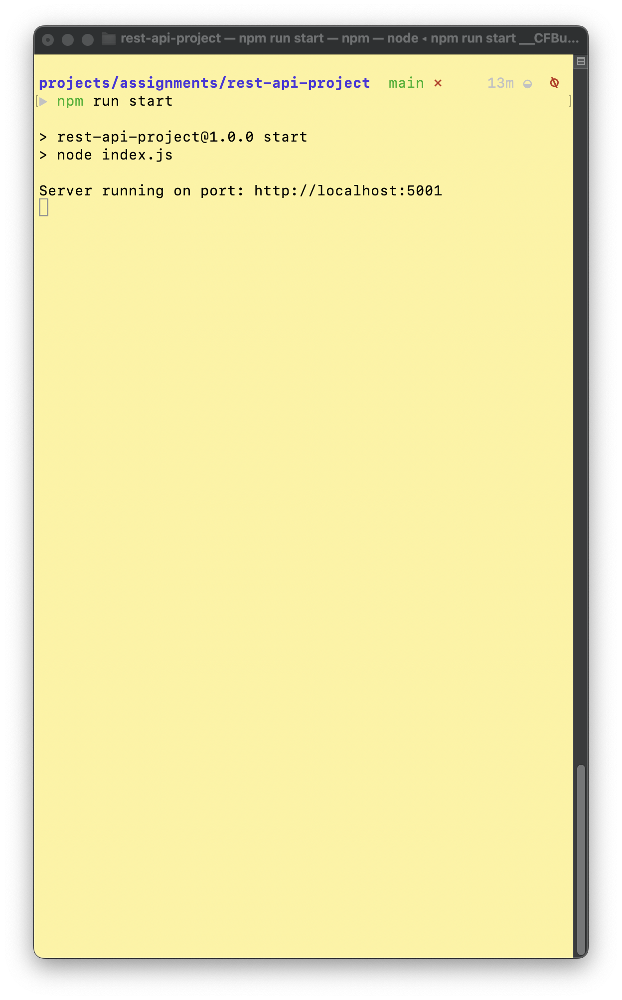
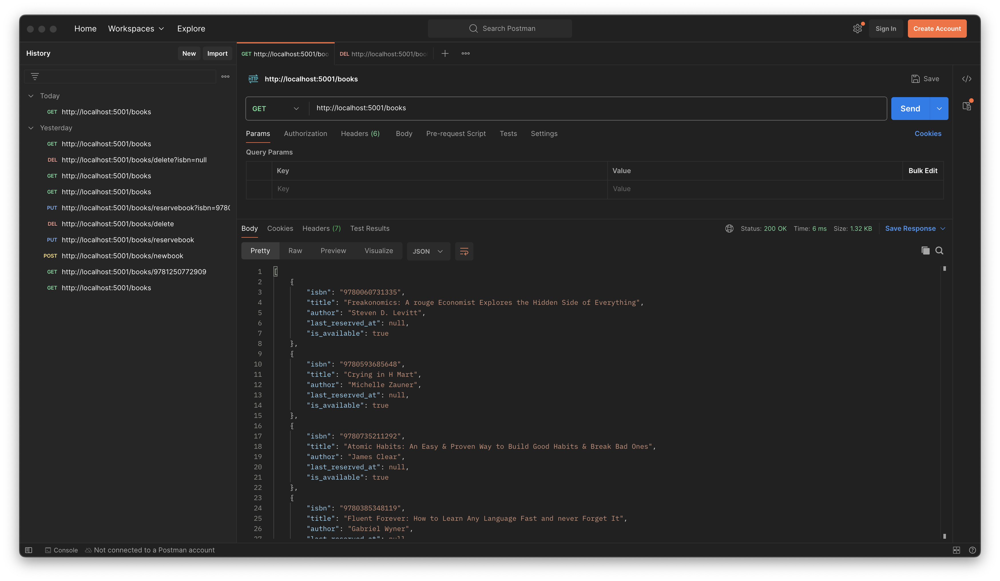
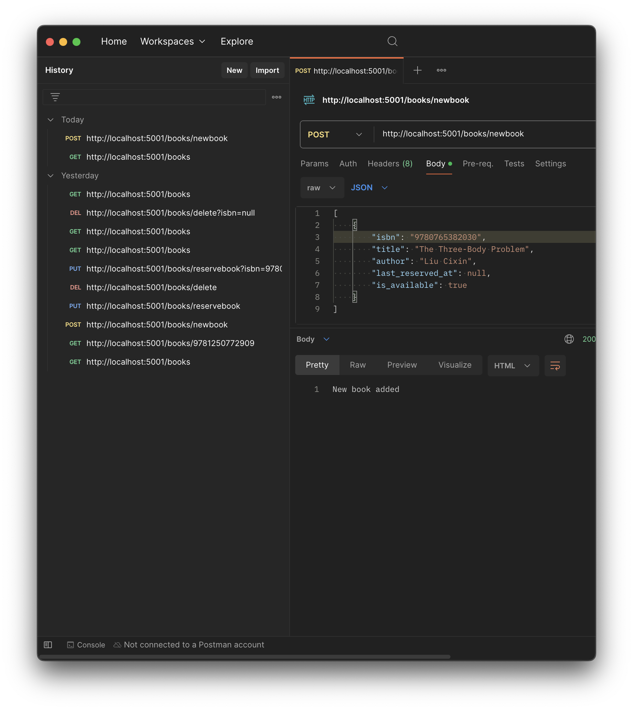
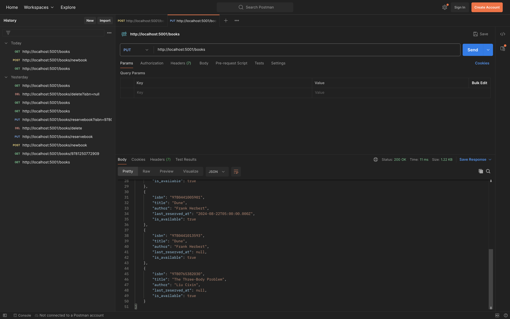
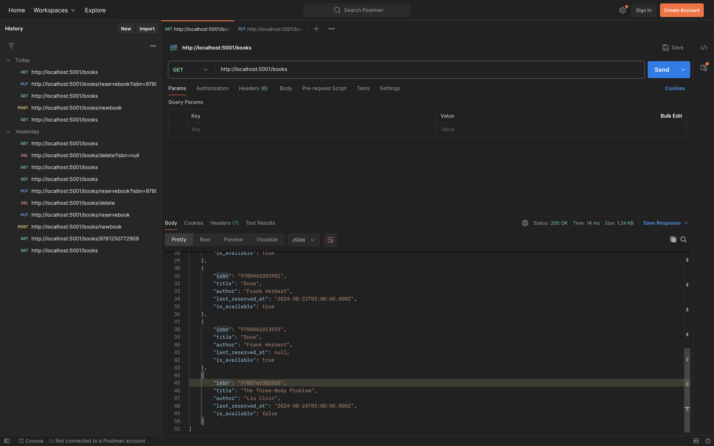
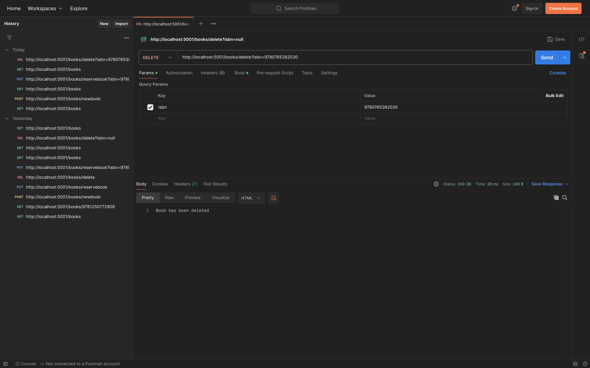
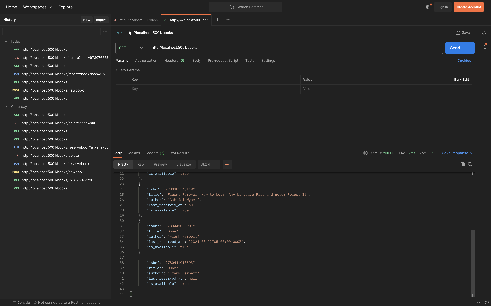

# Welcome to My Tuyen's Library

## About

This is a rest API project that connects to a postgresql database.

The server acts as a pseudo-librarian, allowing you to get a list of books (not filtered by availability), add new books to the library database, checkout a book, and delete a book from database.

## Start Server

This is the command and response to start the server. The default port is 5001.

## Get Route 

This is the route to get all books in library database.
 

## Post Route 

This is the route to post books. Technically, no information is required to post a new bookThe required information to post a new book is
isbn, title, author, last_reserved_at, is_available.

Below is the snapshot of a successful post request.

This the result of a successful post request. By using a get request to dispaly all books in current table, 
you can see a new book was added.

## Put Route

This is the route to make a reservation for a book. 

Below is an example of the reservation successfully made. The result is the is_available property is set to false
to indicate the book is no longer available for checkout. The last_reserved_at property takes the value of the 
date that was passed in by the client.
 

 ## Delete Route

This the route to delete a book from the library database.

Below is a successful delete request.

Below shows the book that was deleted is so no longer in the library database.

